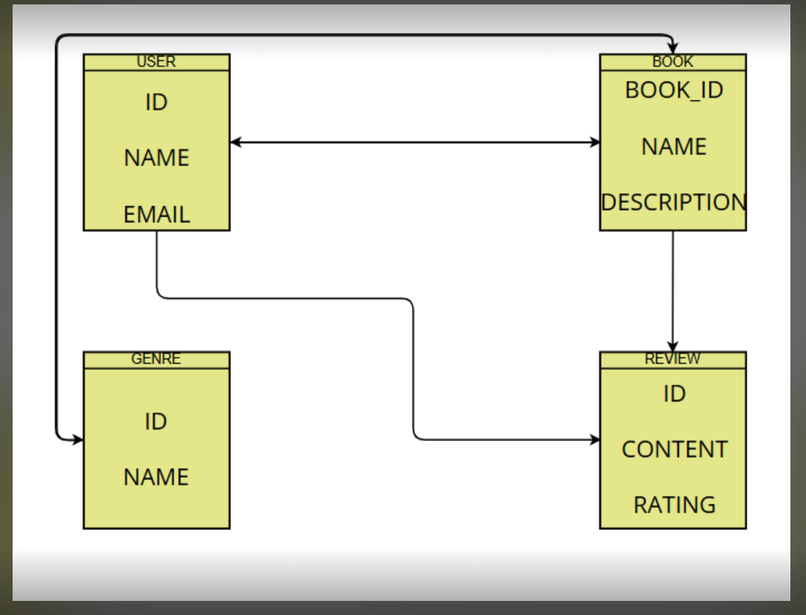

# 📘 QuillCast – Book Review Platform

---

## 🧠 Project Description
QuillCast is a full-stack book review platform designed to help readers make smarter decisions about what they read.  
It provides a clean and interactive interface for exploring books, writing reviews, and organizing personal reading lists such as "Favorites" and "Read."

---

## 📋 What's Included in This README

### 📂 Planning Materials
This project includes:
- Component planning
- API design
- ERD design
- Frontend/backend folder structure
- Authentication flow diagram

---

### 🧱 ERD Diagram
Visual representation of the data models and relationships.  
📌 Models: Book, Review, Genre  
📌 Relationships: One-to-many (Book → Reviews), Many-to-many (User → Favorites/Reads)

<!--  -->


---

### 🛣️ API Routes Overview

**Auth**
- `POST /api/signup/` – Register new user  
- `POST /api/login/` – Log in 

**Books**
- `GET /api/books/` – List books  
- `POST /api/books/` – Add new book  
- `GET /api/books/:id/` – Book details  
- `PUT /api/books/:id/` – Update book  
- `DELETE /api/books/:id/` – Delete book

**Reviews**
- `GET /api/books/:id/reviews/` – List book reviews  
- `POST /api/reviews/` – Create review  
- `DELETE /api/reviews/:id/` – Delete review

**Genres**
- `GET /api/genres/` – List genres  
- `POST /api/genres/` – Create genre  
- `GET /api/genres/:id/books/` – Books under genre

**Favorites / Read**
- `POST /api/books/:id/toggle-favorite/`  
- `POST /api/books/:id/toggle-read/`

---

## 🧰 Technologies Used

### Frontend
- React (Vite)
- Tailwind CSS
- React Router

### Backend
- Django
- Django REST Framework
- Docker

---

## ⚙️ Installation Instructions

### Backend
```bash
git clone https://git.generalassemb.ly/faisalfahad14/QuillCast_Backend.git
cd QuillCast_Backend
docker-compose up --build
```

### Frontend
```bash
git clone https://git.generalassemb.ly/faisalfahad14/QuillCast_Frontend.git
cd QuillCast_Frontend
npm install
npm run dev
```

---

## ✅ Summary
This README is a reference point for QuillCast’s architecture, functionality, and setup.  
It includes planning, API structure, database models, and the technologies used to build the platform.

